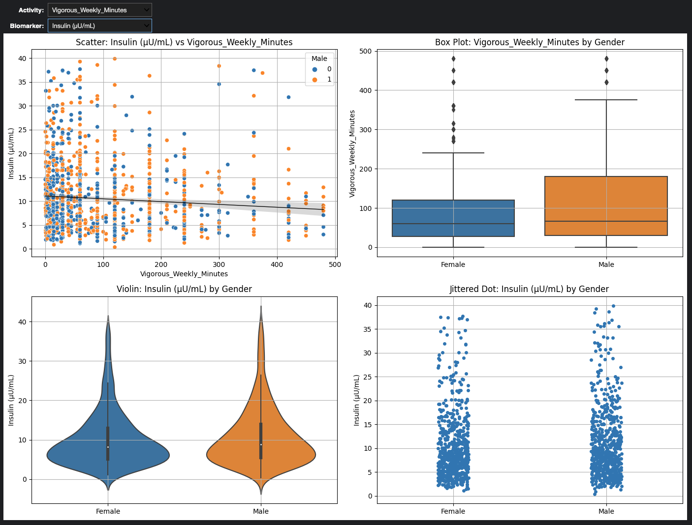

# Physical Activity & Metabolic Health Analysis

This project explores how weekly physical-activity levels relate to metabolic markers—especially **fasting insulin**—using real NHANES data.  
Our goal is to uncover clear, reproducible links between movement and metabolic health.

## 🌐 Live Report (Rendered HTML)

A code-free, fully rendered walkthrough is hosted on GitHub Pages:

**https://yasthilsingh.github.io/MetabolicHealthProject/**

Open that URL in any browser to read the narrative, explore the charts, and download assets—no cloning required.

---

## 📊 What This Project Does

* Converts raw NHANES activity surveys into **weekly minutes** of moderate & vigorous exercise  
* Cleans and standardizes biomarker variables (fasting glucose, insulin, HDL, etc.)  
* Detects and caps outliers using percentile thresholds  
* Visualizes the link between activity and insulin sensitivity  
* Compares metabolic markers between active and less-active groups

---

## Data Sources

This project relies exclusively on publicly available data from the **National Health and Nutrition Examination Survey (NHANES)**, conducted by the U.S. Centers for Disease Control and Prevention (CDC).

| NHANES Cycle | Key Files Used<sup>†</sup> | Download Page |
|--------------|---------------------------|---------------|
| 2011–2012 | `DEMO_G.xpt`, `GLU_G.xpt`, `PAQ_G.xpt` | https://wwwn.cdc.gov/nchs/nhanes/search/datapage.aspx?CycleBeginYear=2011 |
| 2013–2014 | `DEMO_H.xpt`, `GLU_H.xpt`, `PAQ_H.xpt` | https://wwwn.cdc.gov/nchs/nhanes/search/datapage.aspx?CycleBeginYear=2013 |
| 2015–2016 | `DEMO_I.xpt`, `GLU_I.xpt`, `PAQ_I.xpt` | https://wwwn.cdc.gov/nchs/nhanes/search/datapage.aspx?CycleBeginYear=2015 |
| 2017–2018 | `DEMO_J.xpt`, `GLU_J.xpt`, `PAQ_J.xpt` | https://wwwn.cdc.gov/nchs/nhanes/search/datapage.aspx?CycleBeginYear=2017 |
| 2019–Mar 2020 | `DEMO_K.xpt`, `GLU_K.xpt`, `PAQ_K.xpt` | https://wwwn.cdc.gov/nchs/nhanes/search/datapage.aspx?CycleBeginYear=2019 |

<sup>†</sup>**Key files**  
- **DEMO\_** files provide demographic variables and sampling weights.  
- **GLU\_** files include fasting plasma glucose & insulin (used for surrogate markers of insulin sensitivity).  
- **PAQ\_** files contain physical-activity questionnaire data (weekly duration and intensity).  
Additional laboratory or examination files (e.g., lipids, CRP) are merged as needed.

All NHANES datasets are released under a public-domain–like license; no special permission is required for academic or commercial use. For an overview of the program and its documentation see the main NHANES portal: <https://www.cdc.gov/nchs/nhanes/index.htm>. :contentReference[oaicite:0]{index=0}

## 🧠 Why It Matters

* Quantifies *how much* movement improves fasting insulin  
* Highlights prevalence of physical inactivity in population samples  
* Guides evidence-based interventions for digital-health products, insurers, and clinicians  

---

## 🔍 Key Visual Output

A custom four-panel dashboard shows:

* **Scatter & regression** – activity (x) vs. insulin (y)  
* **Box & violin** – activity and insulin distributions split by gender  
* **Jitter** – individual datapoints with goal thresholds highlighted

### 📊 Dashboard Snapshot

This snapshot gives a quick visual overview of the dashboard built for analyzing metabolic health metrics:



---

### 📊 Market Analysis Layer

* **96 M U.S. adults** are pre-diabetic  → [CDC 2022](https://www.cdc.gov/diabetes/data/statistics-report/index.html)  
* **30 % adoption** of activity nudges in digital-health apps  → JAMA / *NPJ Digital Med*  
* **~5 % insulin reduction** lowers diabetes risk (clinical consensus)  
* **Direct medical cost** of diabetes ≈ \$9.6 k / person / year  → [ADA 2022](https://diabetesjournals.org/care/article/46/4/454/148746)  
* **Cost-savings potential:** 1 M prevented cases → \$8–10 B annually
---

## 📁 Files in This Repo

| Path | Purpose |
|------|---------|
| **`docs/index.html`** | Live HTML walkthrough (served by GitHub Pages) |
| `metabolic_health_analysis_updated.ipynb` | Cleaned notebook with hidden inputs |
| `LICENSE` |
| `requirements.txt` | Python dependencies |
| `.gitignore` | Ignore rules |
| `README.md` | Project overview |

> **Note:** Raw NHANES `.xpt` datasets are not included. See “Reproduce” below.

---

## 🛠 Tools Used

* **Python 3**, Pandas, NumPy  
* Matplotlib, Seaborn  
* Jupyter Notebook / PyCharm  
* Public NHANES dataset  

---

## 🧭 Next Steps

1. Extend to other biomarkers (cholesterol, HbA1c)  
2. Add demographic segmentation (age, ethnicity)  
3. Deploy as an interactive digital-health dashboard  
4. Layer in economic datasets to estimate healthcare savings (see Market Analysis👇)

---

## 🧪 How to Reproduce Locally

```bash
# 1) Clone
git clone https://github.com/yasthilsingh/MetabolicHealthProject.git
cd MetabolicHealthProject

# 2) (Optional) create a virtual env
python -m venv venv
source venv/bin/activate  # Windows: venv\Scripts\activate

# 3) Install deps
pip install -r requirements.txt

---

Made with care to support better data-driven health decisions.
